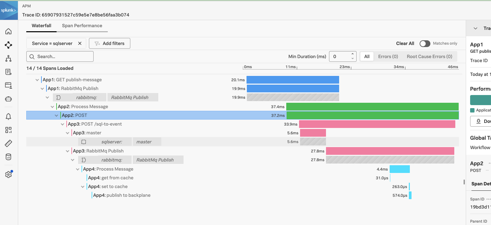

# **Introduction**
This repository contains an example about how to use opentelemetry for tracing when we have a bunch of distributed applications

**Fork**
The repo was originally configured to use Jaeger but now is setup to use Splunk Opentelemetry + Splunk Obervability Cloud

# **Content**

The repository contains the following applications:


- **App1.WebApi** is a **NET 8 API** with 2 endpoints.
    - The **/http** endpoint makes an HTTP request to the App2 _"/dummy"_ endpoint.
    - The **/publish-message** endpoint queues a message into a Rabbit queue named _"sample"_.
    
- **App2.RabbitConsumer.Console** is a **NET 8 console** application. 
  - Dequeues messages from the Rabbit _"sample"_ queue and makes a HTTP request to the **App3** _"/sql-to-event"_ endpoint with the content of the message.

- **App3.WebApi** is a **NET 8 Minimal API** with 2 endpoints
    - The **/dummy** endpoint returns a fixed _"Ok"_ response.
    - The **/sql-to-event** endpoint receives a message via HTTP POST, stores it in a MSSQL Server and afterwards publishes the message as an event into a RabbitMq queue named _"sample_2"_.

- **App4.RabbitConsumer.HostedService** is a **NET 8 Worker Service**.
  - A Hosted Service reads the messages from the Rabbitmq _"sample_2"_ queue and stores it into a Redis cache database.

# **OpenTelemetry .NET Client**

The apps are using the following package versions:

```xml
  <PackageReference Include="OpenTelemetry" Version="1.8.0" />
  <PackageReference Include="OpenTelemetry.Instrumentation.AspNetCore" Version="1.8.1" />
  <PackageReference Include="OpenTelemetry.Exporter.OpenTelemetryProtocol" Version="1.8.0" />
  <PackageReference Include="OpenTelemetry.Extensions.Hosting" Version="1.8.0" />
  <PackageReference Include="OpenTelemetry.Instrumentation.Http" Version="1.8.1" />
  <PackageReference Include="OpenTelemetry.Instrumentation.SqlClient" Version="1.8.0-beta.1" />
  <PackageReference Include="ZiggyCreatures.FusionCache.OpenTelemetry" Version="1.0.0" />
```

# **External Dependencies**

- Splunk Otel 
- MSSQL Server
- RabbitMq
- Redis Cache


# **How to run the apps**

##  **Using docker-compose**

- Clone the repo: ```git clone https://github.com/cesarfr1/opentelemetry-tracing-demo/```
- Create a ```.env``` file to store the splunk access token and set the variables as per example below
```
SPLUNK_ACCESS_TOKEN: your observability token
SPLUNK_REALM: us1
SPLUNK_TRACE_URL: https://ingest.us1.signalfx.com/v2/trace
```
- Update the following variables on the docker-compose.yaml for a tailored test environment:
```
OTEL_RESOURCE_ATTRIBUTES 
OTEL_SERVICE_NAME
```
- Build the application:
```docker compose up```
- Open a curl and trigger a http get on app01 API endpoint: ```curl localhost:5000/publish-message```
- Then you should be able to see the Trace on Observability Cloud




### **23/April/2024**
- Replaced Jaeger with Splunk Otel 


### **04/15/2024**
- Updated apps to .NET 8.
- Updated ``OpenTelemetry`` packages to the latest available version. This update also addresses several known security vulnerabilities.
- Updated ``System.Data.SqlClient`` to the latest available version to mitigate known security vulnerabilities.
- From this point forward, ``App 1`` will function as a .NET 8 API that utilizes Controllers, while ``App 3`` will operate as a minimal API without controllers.
- Deleted ``Startup.cs`` from both App 1 and App 3.
- ``App 1`` and ``App 3`` now employ the newer ``WebApplication.CreateBuilder`` method for application construction, replacing the previous ``WebHost.CreateDefaultBuilder`` method.
- ``App 4`` now utilizes the newer ``Host.CreateApplicationBuilder`` method to construct a ``Host``, replacing the previous ``Host.CreateDefaultBuilder`` method.
- Implemented the C# 12 primary constructor feature across all apps.
- Updated Dockerfile base image from ``Bullseye`` distro (Debian 11) to ``Bookworm`` distro (Debian 12).
- ``App 4`` now employs the [FusionCache](https://github.com/ZiggyCreatures/FusionCache/tree/main) library with a Redis Backplane, replacing the use of ``IDistributedCache``.
- Updated the ``docker-compose`` file to utilize the latest image versions of RabbitMQ, Redis, and Jaeger.


### **09/24/2023**
- Updated apps to .NET 7.
- Updated ``OpenTelemetry`` packages to the latest version.
- Fix breaking changes on the apps due to the ``OpenTelemetry`` packages upgrade.
- Removed the ``OpenTelemetry.Exporter.Jaeger`` NuGet package from the apps because it has been deprecated. It has been replaced by the ``OpenTelemetry.Exporter.OpenTelemetryProtocol`` package.
- Updated the ``RabbitMQ.Client`` NuGet package to the latest version.
- Updated the ``docker-compose`` file to use the newest image versions of rabbitmq, redis and jaeger. Also the jaeger image is configured so can it can receive OpenTelemetry trace data via the OpenTelemetry Protocol.
